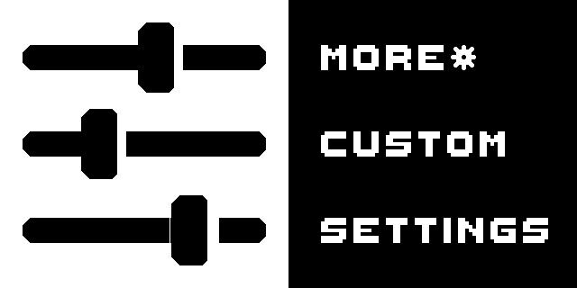
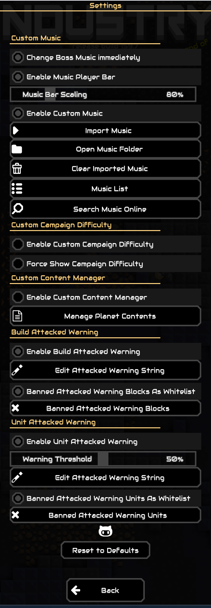
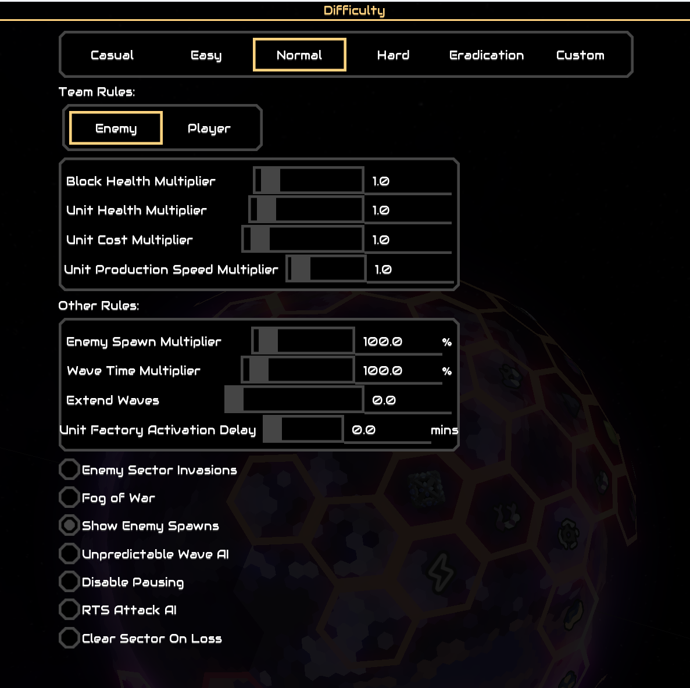
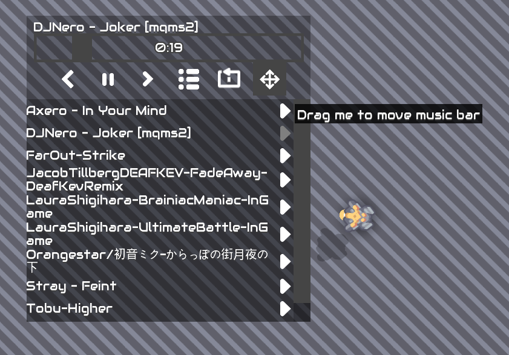
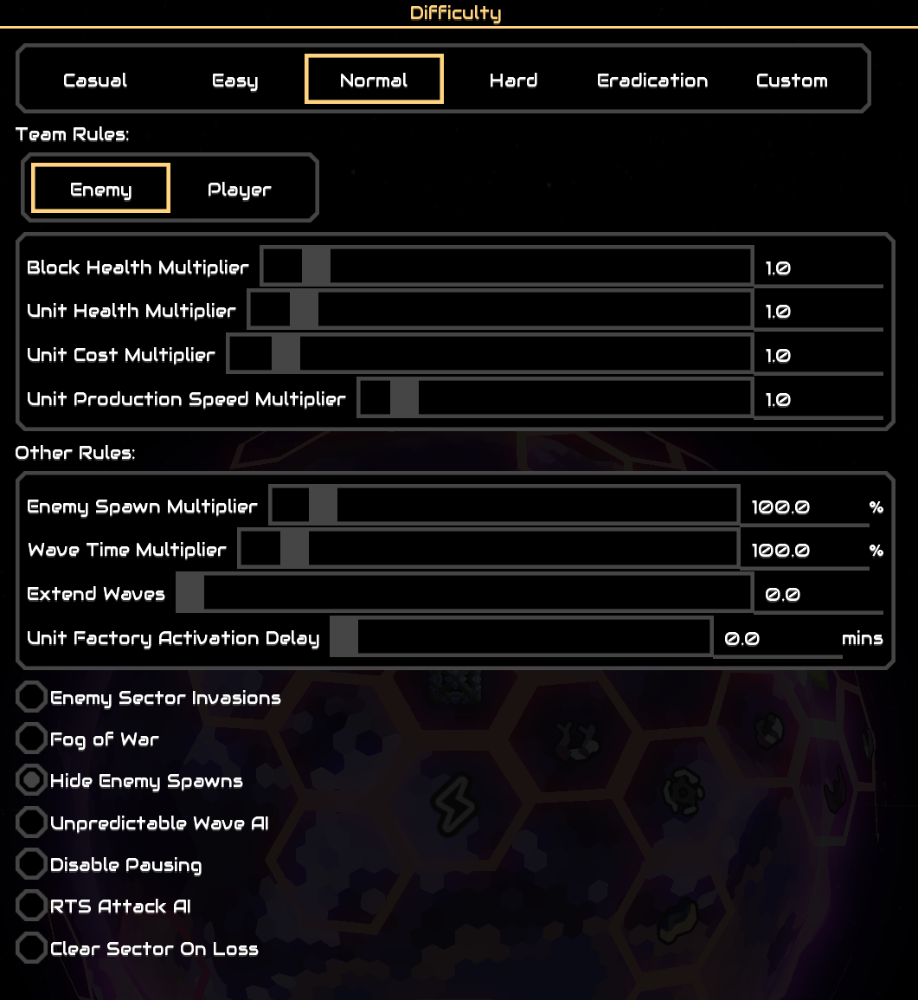
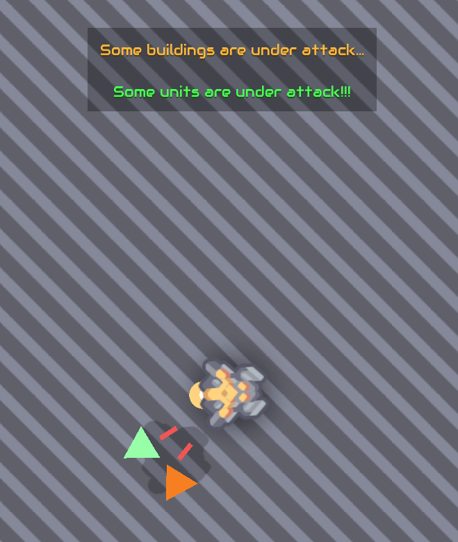
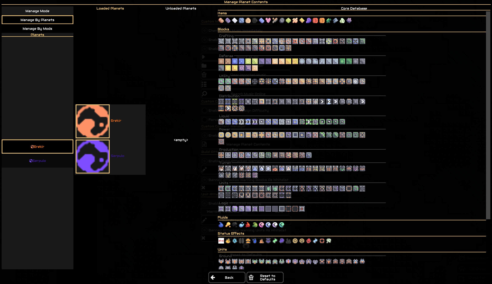

  
  
  
  

***
# More Custom Settings
- Custom Campaign Difficulty
  - Allows customizing enemy/player team health, build speed multipliers, etc.
  - Compatible with vanilla difficulty presets

- Custom Music
  - Supports music customization for the main menu, editor, planet view, and in-game
  - Supports importing via local files / online download
  - Can switch songs in real-time via the music player bar in game

- Custom Content Management
  - Aims to bypass the planet content isolation in V8
  - Allows adding content from other planets/mods to a planet, suitable for mixing mods
  - Real-time database preview

- Building/Unit Hit Notifications
  - Shows HUD notifications when buildings/units are damaged; supports clicking to quickly move the camera to the damaged target's location
  - Directional arrow indicators for off-screen damaged targets
  - Supports customizing which building/unit types trigger alerts
  - Supports custom warning text

- More features in the future...
***
# 更多自定义设置
- 自定义战役难度设置
  - 允许自定义敌人/玩家队伍生命值、建造速度乘数等内容
  - 兼容原版难度预设

- 自定义音乐
  - 支持主菜单/编辑器/星球界面/游戏内的音乐自定义
  - 支持通过本地导入/在线下载导入
  - 可通过音乐控制器实时切换歌曲

- 自定义内容管理
  - 旨在绕过V8版本星球内容隔离
  - 允许往一个星球上添加其他星球/模组内容，适合用于混模
  - 实时数据库预览

- 建筑/单位受击提示
  - 建筑/单位受损时显示HUD通知，支持点击快速定位镜头到受击目标位置
  - 屏幕外受击目标的方向箭头指示
  - 支持自定义受击建筑/单位种类
  - 支持自定义警告文本

- 未来会添加更多功能...
***

***
### - Submit mod bugs or feature requests via Issues
### - 在Issues提交模组的bug或者希望实现的功能